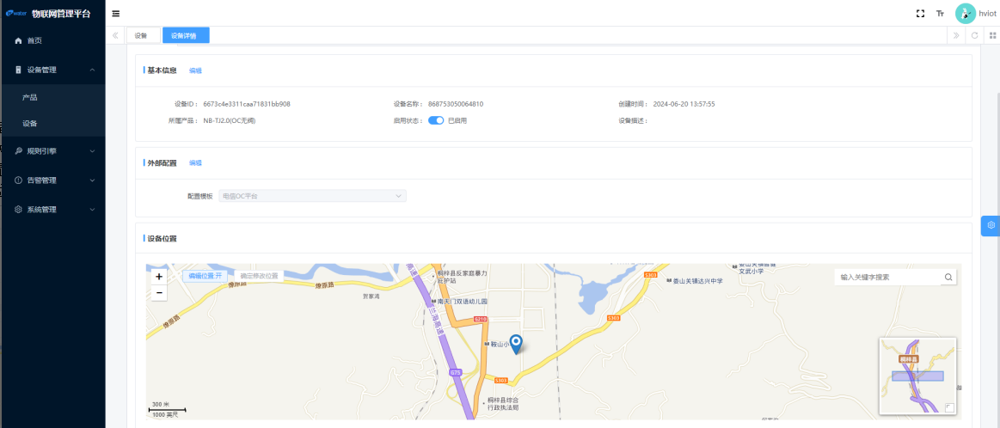

  
  
  

## 项目简介
**矩阵IoT（MatrixIoT）**，做中国人共享共用的IoT软件平台，服务千行百业！个人与企业可 100% 免费使用。

- 融合AI大模型与IoT物联网技术，通过行业标准的物联网协议实现万物互联。
- 原生Native的支持鸿蒙HarmonyOS设备和系统。  
- 广泛支持主流NB、MQTT、HTTP等三方平台接入。  
- 支持千万级设备水平扩展，百万级以上的并发连接。
- 支持单机部署，并提供升级至多机集群的能力。
- 支持私有云和本地部署。

* Java后端：JDK 17 + Spring 2.7
* 管理后台的电脑端（即将开放）：Vue3 + Element Plus
* 管理后台的移动端（即将开放）：采用 [uni-app](https://github.com/dcloudio/uni-app) 方案，一份代码多终端适配，同时支持 APP、小程序、H5！
* 后端采用 Spring Cloud Alibaba 微服务架构，注册中心 + 配置中心 Nacos，服务网关 Gateway
* 数据库默认使用 MySQL + MongoDB，即将支持 PostgreSQL、MariaDB、TiDB 等，基于 MyBatis Plus、Redis + Redisson 操作
* 消息队列默认使用 RocketMQ
* 权限认证使用 Spring Security & Token & Redis，支持多终端、多种用户的认证系统，支持 SSO 单点登录

## 开源协议

① 本项目采用最宽松的 [MIT License](https://gitee.com/victorlamp/matrixiot-server/blob/master/LICENSE) 开源协议，个人与企业可 100% 免费使用，不用保留类作者、Copyright 信息。

② 代码 100% 开源，企业和个人可完全免费使用。

[更多信息](https://victorlamp.com/products/iot)

# 参考文档

## 运行环境

### 基础服务
1. 安装 Docker Engine
2. 运行 startup.sh，启动基础服务。必选服务：MySQL、MongoDB、Redis、Nacos、RocketMQ，可选服务：Prometheus、Grafana。
3. 依次运行服务：matrixiot-gateway, matrixiot-service-system, matrix-service-core。

# 文档持续完善中...

------

------

# 用户手册

## 目录

### 第1章  登录

#### 1.1 登录教程

用户进入登陆页面，输入系统默认的用户名和密码。

Username： admin

Password： hviot123!@#

- 点击登录，进入安全验证。

- 当安全验证通过后，页面将跳转到物联网平台首页。

- 该页面可看到物联网平台的产品统计、设备统计、告警统计、设备数量统计可视图、设备状态统计可视图、以及地区设备数量分布的各项信息展示。

#### 1.2 个人中心

在物联网平台的首页的右上角可以看到用户头像，点击用户头像，则会显示个人中心，在个人中心用户可以修改个人的基本信息和修改密码。

#### **1.3自定义页面**

点击页面右侧的蓝色齿轮按钮，用户可以自己DIY 页面的UI布局、主题样式和界面显示。同时支持一键切换浅色/深色模式以及添加自定义水印。

### 第2章 设备管理

#### 2.1 产品

打开左侧导航栏 --> 设备管理 --> 产品，即可进入产品管理页面。

##### **2.1.1 创建产品**

点击新增按钮，创建产品。

**基本信息：**

- 产品名称：确保名称具有唯一性和描述性，便于用户识别和搜索。
- 节点类型：选择系统预置的节点类型：如：直连设备/网关设备/网关子设备。（直连设备和网关设备，需要选择连网协议/网关子设备需要选择接入网关协议）
- 数据格式：选择系统预置的数据格式，如： MatrixIoT 标准格式/自定义。
- 产品品类：选择系统预置的产品品类：如：NBIoT水表/LoRaWAN水表....
- 厂商：填写产品的制造商或生产厂家的名称。
- 产品型号：提供产品的具体型号，以便用户区分不同版本或配置的产品。
- 产品描述：详细描述产品的功能、特点、应用场景等，帮助用户更好地理解产品。

> 网关产品所创建的设备可以挂载网关子产品所创建的设备，具有子设备管理模块，维持子设备的拓扑关系，和将拓扑关系同步到MatrixIoT平台。

**外部配置：**

如果该产品与第三方系统或服务集成，请在此处选择MatrixIoT系统预置支持的三方平台配置模板，并填写相关配置信息如API密钥、认证方式、接口地址等。

> 当产品创建成功后，需要点击发布才可以使用。

##### **2.1.2更新产品**

进入产品详情页面，点击编辑，即可更行产品信息。

- 已发布的产品，只允许更新 产品名称，产品描述，产品品类、外部配置;
- 未发布的产品允许更新 产品名称，产品描述，产品品类、外部配置、 厂商、产品型号；

##### **2.1.3删除产品**

删除产品时，点击右侧的更多，则弹出删除/取消发布选项。

- 删除产品前需要先取消发布状态，如果产品下已有绑定设备（网关设备下绑定子网关设备），则无法取消发布，需要把绑定的设备删除完才可以取消发布删除该产品；

##### **2.1.4 导入产品**

物联网平台支持一键导入多个产品，用户需要上传Excel格式的表格文件。以下是详细说明和示例。

> |   字段   | 说明                                                         | 作用                                                         |
> | :------: | ------------------------------------------------------------ | ------------------------------------------------------------ |
> |   描述   | 描述产品信息                                                 | 用于用户了解产品的详细信息。                                 |
> | 节点类型 | 直连设备/网关设备/网关子设备                                 | 必须选择系统预置的节点类型                                   |
> | 连网协议 | NB/LORA/WIFI/CELLULAR/ETHERNET/CUSTOM                        | 必须选择系统预置的联网类型                                   |
> | 连网配置 | {  "type": "HUB_SUB",  "config": {    "ip": "168.666.88.186",    "port": 5001  }} | 即产品的三方配置信息；三方平台配置模板，并填写相关配置信息如API密钥、认证方式、接口地址等。 |
> | 数据格式 | HVIOT/CUSTOM                                                 | 必须选择系统预置的数据格式                                   |
> |  制造商  | 该产品设备的制造商名称                                       | 填写产品的制造商或生产厂家的名称                             |
> |   型号   | 该产品设备的产品型号                                         | 提供产品的具体型号，以便用户区分不同版本或配置的产品         |
> |   品类   | WM_PDRR/WM_LORA....                                          | 选择系统预置的产品品类                                       |
> |  物模型  | { "properties": [  {   "identifier": "electronicNo",   "name": "水表电子号",   "required": true,   "rwFlag": "RO",   "dataType": "Text",   "dataSpec": {    "length": 20   },   "description": "水表电子号"  },  {   "identifier": "currentQuantity",   "name": "当前累积用量",   "required": true,   "rwFlag": "RO",   "dataType": "Number",   "dataSpec": {    "unit": "L",    "unitName": "升"   },   "description": "当前累积用量"  } ]} | 物模型支持定义属性，服务，事件。字段为：properties/services/events。 |

​                                                 

#### **2.2 物模型**

> 物模型是物联网平台为产品定义的数据模型，用于描述产品的功能。本节介绍物模型相关概念和使用限制。

##### 2.2.1 什么是物模型

**功能说明**

物模型是物理空间中的实体（如传感器、车载装置、楼宇、工厂等）在云端的数字化表示，从属性、服务和事件三个维度，分别描述了该实体是什么、能做什么、可以对外提供哪些信息。定义了物模型的这三个维度，即完成了产品功能的定义。

|     功能类型     | 说明                                                         |
| :--------------: | ------------------------------------------------------------ |
| 属性（Property） | 用于描述设备运行时具体信息和状态。例如，环境监测设备所读取的当前环境温度、智能灯开关状态、电风扇风力等级等。属性可分为读写和只读两种类型。读写类型支持读取和设置属性值，只读类型仅支持读取属性值。 |
| 服务（Service）  | 指设备可供外部调用的指令或方法。服务调用中可设置输入和输出参数。输入参数是服务执行时的参数，输出参数是服务执行后的结果。相比于属性，服务可通过一条指令实现更复杂的业务逻辑，例如执行某项特定的任务。服务分为异步和同步两种调用方式。 |
|  事件（Event）   | 设备运行时，主动上报给云端的信息，一般包含需要被外部感知和处理的信息、告警和故障。事件中可包含多个输出参数。例如，某项任务完成后的通知信息；设备发生故障时的温度、时间信息；设备告警时的运行状态等。事件可以被订阅和推送。 |

物模型模块下定义的功能不需要同时包含属性、服务和事件，按需配置即可。

##### 2.2.2 添加单个物模型

在左侧导航栏，选择设备管理  --> 产品。在已创建的产品，点击产品详情，再选择物模型，即可看到属性定义、事件定义、服务定义。

可以选择切换不同的模块，点击新增按钮，在填写完后，点击保存即可。

> 名称和标识符在该产品物模型下应该具有唯一性，不可重复。

##### **2.2.3 批量添加物模型**

当产品拥有多个功能类型时，单个的添加物模型可能会花费很长时间，此时建议您可通过导入产品来快速批量添加属性、事件和服务，即将已编辑好的物模型JSON或其他产品的物模型JSON添加到Excel的物模型种=种，然后导入产品，并选择更新已存在的产品数据，即可实现批量添加该产品的物模型。可参考***2.1.4*** 导入产品。

##### 2.2.4 编辑/删除物模型的属性、事件和服务

在物模型页面的右侧可以看到编辑和删除按钮，注意在编辑时也要保证名称和属性在该产品下应该具有唯一性，不可重复。

#### **2.3消息解析**

##### 2.3.1 什么是消息解析

物联网平台定义设备消息的标准数据格式为 Alink JSON。对于低配置且资源受限或者对网络流量有要求的设备，不适合直接构造JSON数据与物联网平台通信，可将原数据透传到物联网平台。

**数据格式为透传/自定义**的产品下的设备与云端进行物模型数据通信时，需要物联网平台调用您提交的消息解析脚本，将上、下行物模型消息数据分别解析为物联网平台定义的标准格式（Alink JSON）和设备的自定义数据格式。

物联网平台接收到来自设备的数据时，先运行解析脚本，将透传的消息数据转换成Alink JSON格式的数据，再进行业务处理；物联网平台下发消息给设备前，也会先通过脚本将消息数据转换为设备的自定义格式，再下发给设备。

##### **2.3.2添加脚本解析**

平台使用JS和Groovy脚本引擎实现功能扩展。除了 MQTT 和 HTTP 支持之外，还可以使用自定义的脚本实现或自定义现有协议的行为。

- 在左侧导航栏，选择 设备管理 --> 产品。在已创建的产品，点击产品详情，再选择脚本解析，即可进入到脚本解析页面。
- 用户可选择系统预置脚本，如下图所示。

-  用户可以选择自定义JS脚本，如下图所示。

#### **2.4设备**

打开左侧导航栏  --> 设备管理 --> 设备，即可进入设备管理页面。

##### **2.4.1创建设备**

点击新增按钮，创建设备,在创建设备页面，输入设备信息，单击确认。

**基本信息：**

设备名称：确保名称具有描述性，便于用户识别和搜索，设备名称可重复。

所属产品：该设备所属的产品类型。

设备描述：详细描述设备的基本信息。

启用状态：默认为启用。

**外部配置：**

当选择的产品为三方平台时，则会出现外部配置。比如：AEP有阀 产品，按照相应的设备信息填写即可。

##### 2.4.2 搜索设备

在设备页面，用户可以在上面搜索栏输入关键字产找指定设备，也可以通过下拉框选择[状态]和[所属产品]的方式来筛选设备。

##### 2.4.3 更新设备

在设备页面，点击右侧的详情，进入到设备详情页面，可以看到基本信息|外部配置|设备位置的信息，用户可点击相应项右侧的编辑来更新相应的信息。

- 基本信息：可以更新设备名称、设备描述。
-  外部配置：可以更新相关的所有内容。
- 设备位置：点击编辑位置，通过搜索栏输入相应信息快速查找位置，拖动视图将【标注】移动到相应的设备实际位置上，然后点击确认修改位置按钮即可。

##### 2.4.4  设备删除

在设备页面，将鼠标移动到”更多”，则会有相应的弹出框显示[删除]和[启用]，然后点击[删除]即可。（当设备启用状态下禁止删除，如果该设备是网关产品类型的设备，需要先在设备详情页解除其下所有关联的子设备后才可以删除）

##### **2.2.5设备数据**

> 设备管理 --> 设备 --> 设备详情 --> 物模型属性

该页面用户可看到设备各个时间上报的各项数据，如：用水量，电池电压，采集时间以及各项设备信息。

> 设备管理 --> 设备 --> 设备详情 --> 事件

该页面用户可看到设备的一些设备的关键事件情况，比如：设备开关，低电量警告，温度异常等信息，可以有助于用户更好的掌握该用户一些具体信息，以便做出决策。

##### 2.2.6 子设备管理

当设备属于**网关产品**类型时，则该设备的设备详情页面则会有[子设备]页面。

在这里用户可以自行添加相关联的产品下的设备，可以选择单个添加，也可以一键添加某产品下的全部设备。

> 注意：一个子设备只能绑定在一个网关设备下，不允许同时绑定多个网关设备中。

##### 2.4.7导入/导出设备

- 导入设备

在设备页面可以看到蓝色[导入]按钮，当点击导入设备，选择要导入的产品类型，点击确定即可。

> 注意：文件应符合该产品要求的文档格式。

- 导出设备

在设备管理页面可以看到绿色[导出]按钮，点击导出设备，[确定]即可导出所有的设备数据。

### 第3章 规则引擎

####  3.1场景规则

**定义**：规则引擎是一种基于规则的系统，它根据预定义的规则对输入数据进行处理和判断，并根据判断结果执行相应的操作。在物联网中，规则引擎通常用于实现设备之间的联动和告警功能。

**作用**：规则引擎能够灵活地定义和修改物联网设备之间的联动逻辑和告警条件，使得物联网系统更加灵活和可配置。通过规则引擎，用户可以轻松地实现各种复杂的业务场景和逻辑判断。

#### 3.2数据路由

物联网（ MatrixIoT ）中的数据路由涉及将设备生成的数据从源头（例如传感器或其他设备）传输到最终的存储、处理或消费点（例如云平台、数据库或应用程序）。数据路由是物联网系统中关键的部分，它确保数据能够可靠地传输并在适当的地点进行处理和利用。

##### 3.2.1创建数据路由

- 点击右侧导航栏的数据路由。然后选择数据路由，即可跳转到数据路由的界面。

- 点击[新增]，跳转到创建数据路由页面。

**基本信息**

路由名称：路由的标识名称。

路由描述：对该路由的简要描述。

**数据源**

Topic：数据源的MQTT主题。指定从哪个主题接收数据。

产品：数据源设备所属的产品类型。

设备：数据源设备（可选全部或单个设备）

**数据目的**

类型：REST API/RabbitMQ。数据目的地的类型，可以是云平台、数据库等。

**转换脚本**

语言：使用的脚本语言（JavaScript）

脚本内容：用于编写数据转换的脚本代码。

##### 3.2.2编辑数据路由

在数据路由界面的右侧点击 [编辑]，即可修改配置信息。

##### 3.2.3删除数据路由

将鼠标移至数据路由界面的右侧 [更多]，会出现 [删除]，点击即可删除数据路由。

### 第4章 告警管理

> 定义：告警是物联网系统中当特定条件或事件发生时，系统向用户或相关人员发出的通知或警告。
>
> 作用：告警能够及时发现异常情况，帮助用户快速响应并处理潜在问题，从而保障物联网系统的稳定运行和安全性。
>
> 例子：在某些情况下，场景联动可能会触发告警。例如，在智能家居中，如果室内温度超过预设的安全阈值，场景联动可能会自动打开空调并触发高温告警通知用户。

#### 4.1告警配置

用户可以高度自定义告警配置，针对不同产品灵活设置不同的告警配置规则，并为每个告警配置指定专属负责人及其联系方式（包括电话、邮箱等），同时赋予告警明确的等级划分。一旦达到预设的告警等级，平台将自动触发场景联动机制，即时向相应的负责人发送详尽的告警信息，确保他们能够迅速响应，对设备进行精准处理与决策，从而有效提升问题解决效率与系统运维的智能化水平。

#### 4.2告警记录

用户在该页面能够全面浏览物联网平台的所有告警记录信息，实现对平台下所有设备的运行状况进行宏观监控与细致分析。这一功能不仅帮助用户快速定位潜在问题，还能通过历史告警数据的分析，洞察设备的性能趋势与潜在风险，进而为优化设备管理策略、提升整体运维效率提供有力支持。并且相关负责人在对设备告警处理后，可以及时更新相关设备告警的状态。

### 第5章 实时监控

#### 5.1 IOT监控

点击右侧导航栏的 [实时监控]，然后选择 [IOT监控]即可跳转到IOT监控界面。在该页面，用户可以看到平台实时监控的设备在线数量曲线图，并可以通过 [时间]下拉框选择查看过去7天、1天、12小时、6小时或1小时的变化。

#### 5.2系统监控

##### 5.2.1添加物模型监控

- 指标名称：自定义指标名称。支持中文、数字、英文字母和下划线（_），长度限制为1~32个字符。
- 产品：选择指标数据所属的产品。
- 设备：选择指标数据所属的设备。默认选择全部设备，可选择单个设备。
- 属性：选择产品下的物模型模块和属性。目前支持数值类型。
- 聚合类型：指标数据的聚合方式。支持聚合方式有最新值、计数、求和、最小值、最大值、平均值。
- 聚合频率：聚合数据的时间频率。可选：1分钟、5分钟。

##### 5.2.2删除物模型监控

物模型监控暂不支持更新，如果需要改动，则需要删除旧的物模型监控，然后根据实际场景需求添加新的物模型监控。

### 第6章 系统管理

#### 6.1租户管理

> 多租户，简单来说是指一个业务系统，可以为多个组织服务，并且组织之间的数据是隔离的。例如说，在服务上部署了一个 MatrixIoT-server，可以支持多个不同的公司使用。这里的一个公司就是一个租户，每个用户必然属于某个租户。因此，用户也只能看见自己租户下面的内容，其它租户的内容对他是不可见的。

多租户主要有两个业务功能：

| 业务功能 |                        说明                        |                界面                 |
| :------: | :------------------------------------------------: | :---------------------------------: |
| 租户管理 |         配置系统租户，创建对应的租户管理员         |  |
| 租户套餐 | 配置租户套餐，自定每个租户的菜单、操作、按钮的权限 |  |

#### 6.2用户管理

在用户管理界面，管理员可以新增用户：

#### 6.3角色管理

#### **6.4菜单管理**

项目的菜单在 [系统管理 -> 菜单管理] 进行管理，支持无限层级，提供目录、菜单、按钮三种类型。

#### **6.4部门管理**

#### **6.5岗位管理**

#### **6.6审计日志**

##### **6.6.1操作日志**

##### **6.6.2登录日志**

登录日志，记录用户的登录、登出行为，包括成功的、失败的。

打开 [系统管理 -> 审计日志 -> 登录日志] 菜单，可以看对应的列表，如下图所示：

